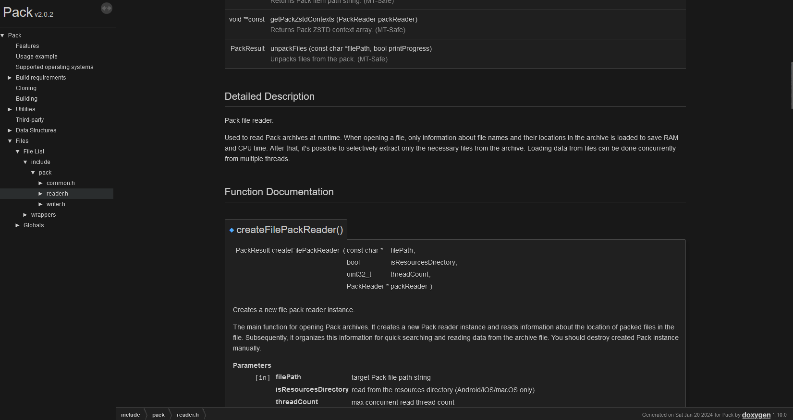

# Redoxygen

This is a [Doxygen](https://www.doxygen.nl) theme with a refreshed modern design, inspired by the appearance of VS Code and documentation for other programming languages. The theme is built based on Doxygen 1.10.0



# Usage

1. Clone to the **docs/** directory: ```git clone https://github.com/cfnptr/redoxygen```
2. Update the **Doxygen** file: ```HTML_EXTRA_STYLESHEET  = redoxygen/theme.css```